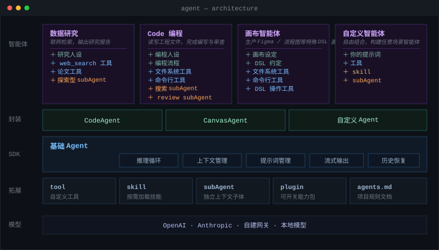
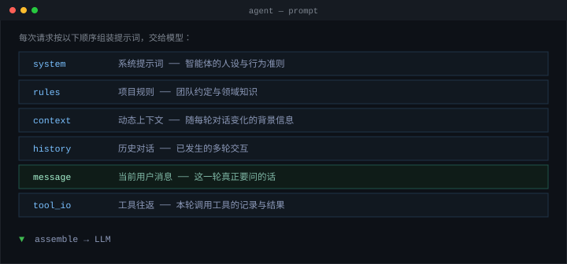

<div align="center">

# Agent SDK

**面向浏览器与服务端的 AI Agent 框架**

一套可插拔的Agent底座，接入任意模型，配置提示词、装配不同能力，即可支撑对话、研究、代码、画布等各类智能体形态。

</div>

---

## 介绍

`@mybricks/agent` 把「一次 AI 任务」抽象为一个可流式消费的循环：模型思考 → 调用工具 → 观察结果 → 继续思考，直到任务完成。框架负责这套循环里所有繁琐但关键的工程细节——多步推理、上下文治理、流式输出、工具编排、历史恢复——你只需专注在**如何设计提示词、接入哪个模型、装配哪些能力**上。

基于一个**基础 Agent**，装配不同的工具、再用**提示词**赋予它角色与行为，就得到面向不同场景的智能体

| 智能体 | 人设 / 流程 | 工具 | subAgent |
| :-- | :-- | :-- | :-- |
| **数据研究** | 研究人设 | web_search、论文工具 | 探索型 subAgent |
| **Code 编程** | 编程人设 + 编程流程 | 文件系统、命令行 | 搜索 subAgent、review subAgent |
| **画布智能体** | 画布设定 + DSL 约定 | 文件系统、命令行、DSL 操作工具 | — |
| **自定义智能体** | 你的提示词 | 工具、skill | subAgent |

**特点**

- 🔌 **可插拔** —— 模型、工具、文件后端、提示词都能替换，无需 fork
- 🌐 **模型无关** —— 任何支持工具调用的 LLM 都能接入：OpenAI / Anthropic / 自建网关 / 本地模型
- ♾️ **同构** —— 同一套 API，浏览器与服务端都能运行
- 📦 **开箱即用** —— 默认值面向长任务调优，构造完即可运行

## 架构

<div align="center">



</div>

## 提示词管理

<div align="center">



</div>

## 快速开始

安装：

```bash
npm install @mybricks/agent
```

所有 API 从子路径 `@mybricks/agent` 导入。

### 在浏览器中运行

无需任何后端即可跑起一个完整的代码智能体：

```ts
import { CodeAgent, IDBSandbox, Tools } from "@mybricks/agent";
import type { RemoteProviderConfig } from "@mybricks/agent";

const openai: RemoteProviderConfig = {
  providerId: "openai",
  format: "openai",
  baseUrl: "https://api.openai.com/v1",
  apiKey: import.meta.env.VITE_OPENAI_API_KEY,
  models: [{ id: "gpt-4o", name: "GPT-4o" }],
};

const agent = new CodeAgent({
  key: "my-agent",
  sandbox: new IDBSandbox({
    key: "my-agent",
    initialFiles: [
      { path: "README.md", content: "# Hello" },
      { path: "src/index.ts", content: "console.log('hi');" },
    ],
  }),
  llm: { providers: [openai] },
  tools: [Tools.createWebFetch()], // 可选：联网能力
});

// 流式渲染
agent.events.on("llm:content", (e) => appendToUI(e.delta));
agent.events.on("turn:complete", () => console.log("done"));

await agent.requestAI({ message: "给 index.ts 加上类型注解" });
```

### 在服务端运行

```ts
import { CodeAgent } from "@mybricks/agent";
import type { Sandbox, UnifiedFile, RemoteProviderConfig } from "@mybricks/agent";
import { promises as fs } from "node:fs";
import path from "node:path";

const ROOT = process.cwd();

const nodeSandbox: Sandbox = {
  async getFiles() {
    const walk = async (dir: string, acc: UnifiedFile[] = []): Promise<UnifiedFile[]> => {
      for (const e of await fs.readdir(dir, { withFileTypes: true })) {
        const full = path.join(dir, e.name);
        if (e.isDirectory()) await walk(full, acc);
        else acc.push({ path: path.relative(ROOT, full), content: await fs.readFile(full, "utf8") });
      }
      return acc;
    };
    return walk(ROOT);
  },
  async updateFiles(files) {
    await Promise.all(files.map(async (f) => {
      const full = path.join(ROOT, f.path);
      await fs.mkdir(path.dirname(full), { recursive: true });
      await fs.writeFile(full, f.content, "utf8");
    }));
  },
  async deleteFiles(ps) {
    await Promise.all(ps.map((p) => fs.rm(path.join(ROOT, p), { force: true })));
  },
};

const anthropic: RemoteProviderConfig = {
  providerId: "anthropic",
  format: "anthropic",
  baseUrl: "https://api.anthropic.com/v1",
  apiKey: process.env.ANTHROPIC_API_KEY!,
  models: [{ id: "claude-sonnet-4-5", name: "Claude Sonnet 4.5" }],
};

const agent = new CodeAgent({
  key: "server-agent",
  sandbox: nodeSandbox,
  llm: { providers: [anthropic] },
  system: "你是一个谨慎的代码助手，改动前先读取确认。",
});

await agent.requestAI({ message: "给所有 .ts 文件补上类型注解" });
```

## 对接三方 API

模型对接统一走 `llm.providers`，两种方式：

**直连供应商** —— 对接 OpenAI / Anthropic 兼容接口，框架自动拼装端点：

```ts
const openai: RemoteProviderConfig = {
  providerId: "openai",
  format: "openai",          // 或 "anthropic"
  baseUrl: "https://api.openai.com/v1",
  apiKey: process.env.OPENAI_API_KEY!,
  models: [{ id: "gpt-4o", name: "GPT-4o" }],
};

new CodeAgent({ llm: { providers: [openai] } });
```

**自定义网关** —— 把请求委托给你自己的函数，适用于自建路由、私有化部署或本地模型：

```ts
const provider: CustomProviderConfig = {
  providerId: "auto",
  models: [{ id: "auto", name: "智能选择" }],
  request: myGateway,   // RequestAsStreamFn：接管请求并回吐流式增量
};
```

发起请求时也可指定单次使用的模型：`agent.requestAI({ message, providerId, modelId })`。

## 拓展

### 自定义工具

实现 `Tool` 接口并通过 `tools` 注入，即可被模型调用。这是把基础 Agent 拓展成研究、业务等各类智能体的主要方式：

```ts
import type { Tool } from "@mybricks/agent";
import { ToolValidationError } from "@mybricks/agent";

const searchTool: Tool = {
  name: "search_kb",
  title: "知识库检索",
  description: "在企业知识库中检索相关内容",
  parameters: {
    type: "object",
    properties: { query: { type: "string", description: "检索关键词" } },
    required: ["query"],
  },
  validate(p) {
    if (!p.query) throw new ToolValidationError("query is required");
  },
  async execute(p) {
    const docs = await kb.search(p.query);
    return { output: docs.map((d) => d.text).join("\n"), metadata: { count: docs.length } };
  },
};

// 基础 Agent + 联网 + 知识库 = 数据研究智能体
new Agent({
  system: "你是一名研究员，先检索事实再作答，最终输出结构化报告。",
  tools: [searchTool, Tools.createWebFetch()],
  llm: { providers: [openai] },
});
```

### 模式切换

框架内置 `build`（直接执行）与 `plan`（先出方案再执行）两种模式，支持定制拓展。

### 更多扩展

- **Skills** —— 可复用技能包，模型按需加载，不占用常驻上下文
- **SubAgents** —— 委派任务给拥有独立上下文的子智能体
- **Plugins** —— 把 Skills / SubAgents / 工具打包成可开关的插件
