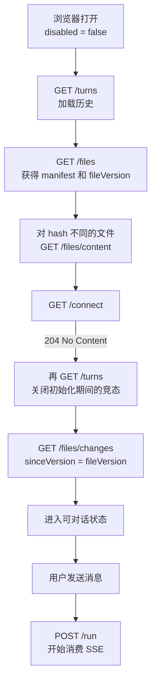
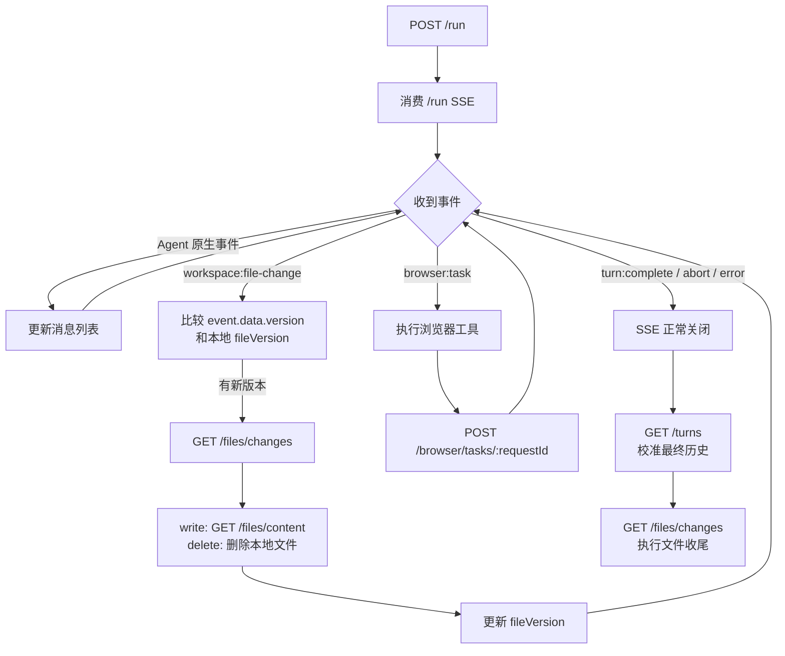
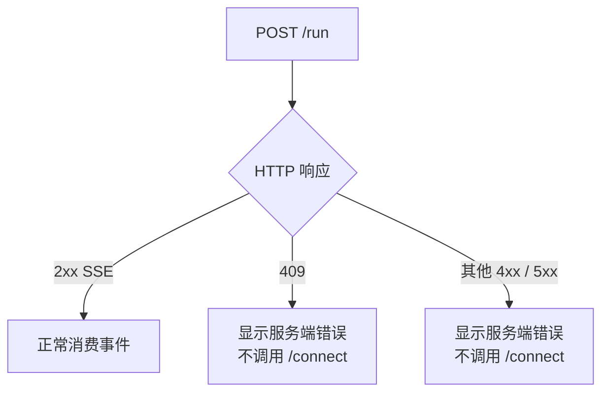
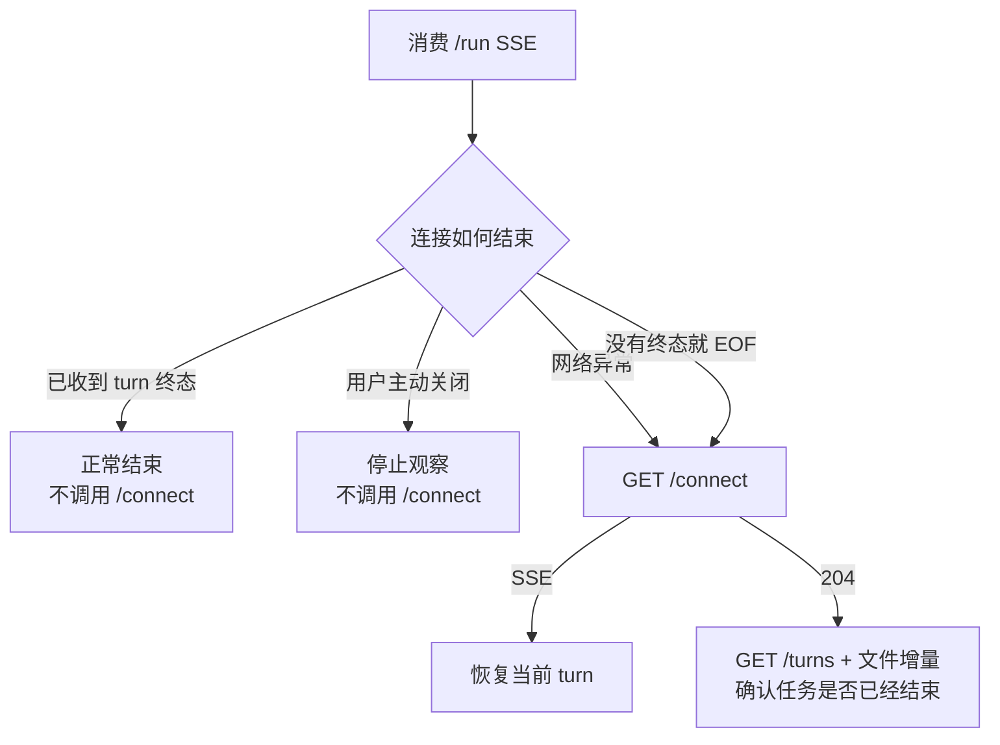
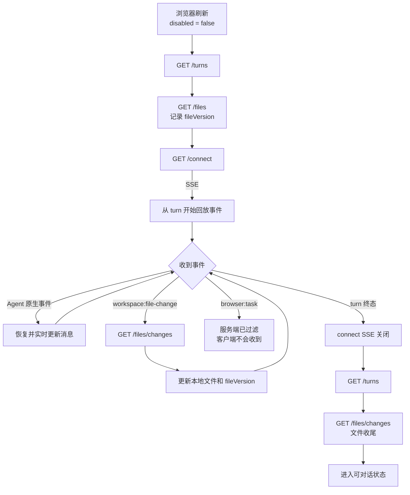
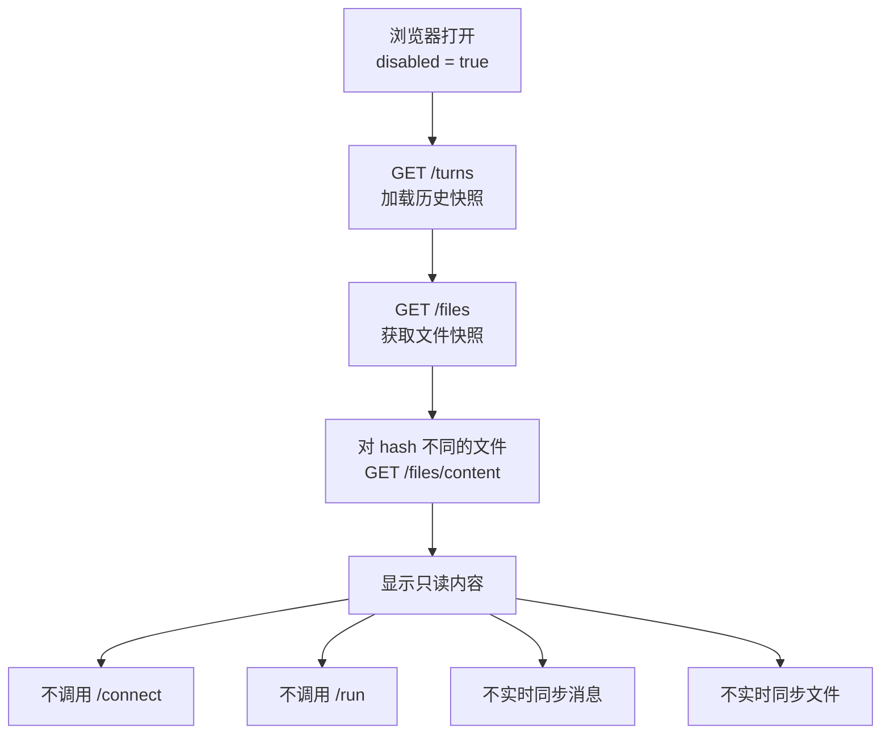
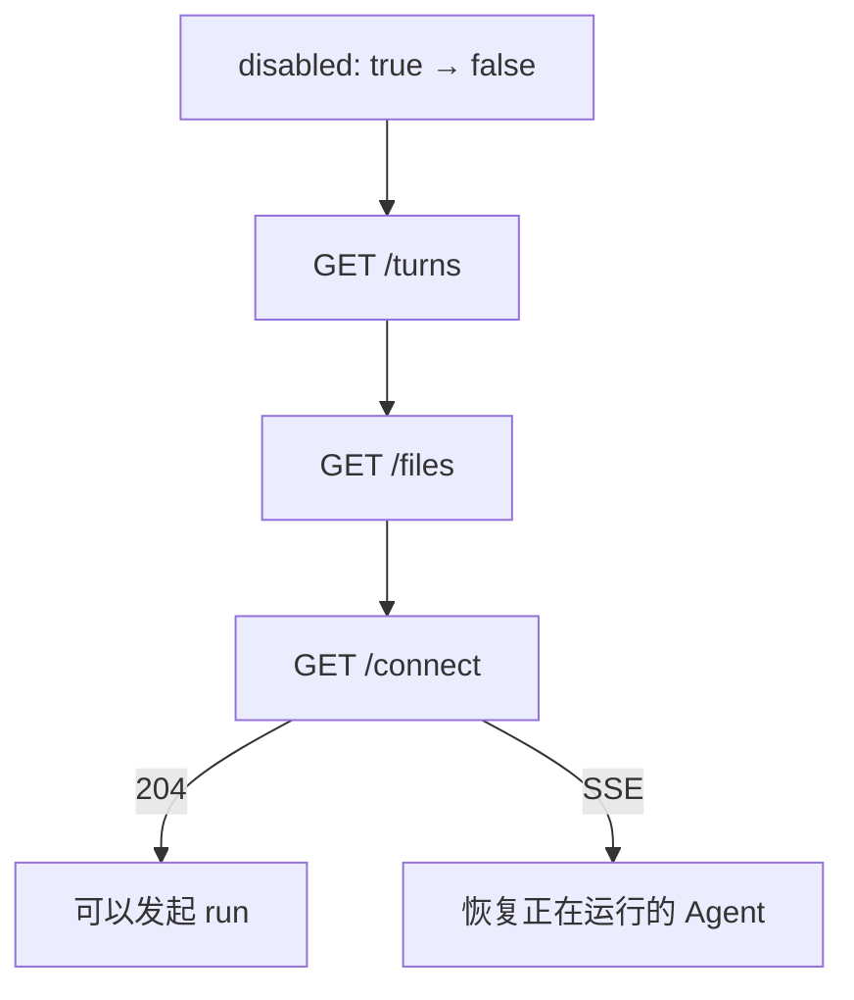
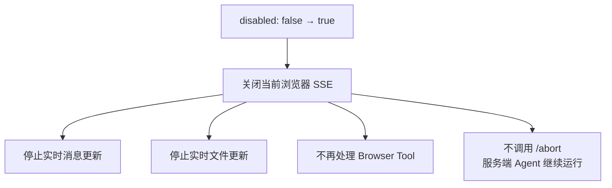
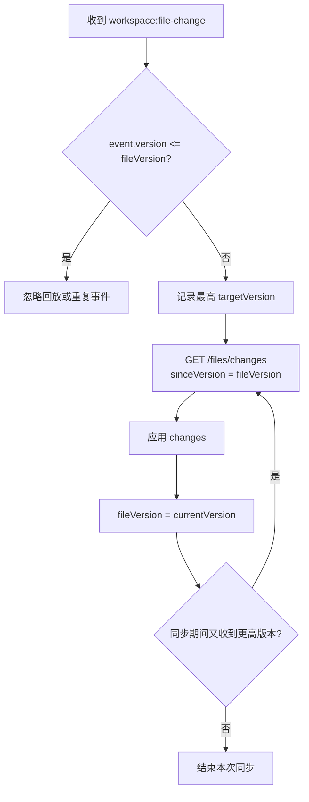
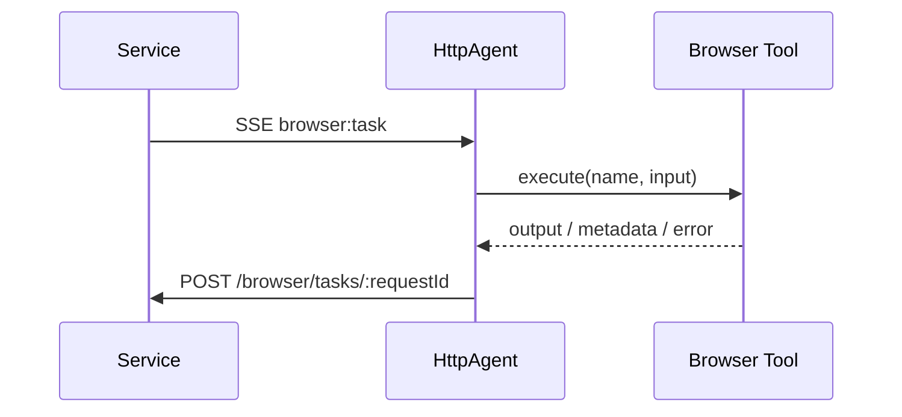

# HttpAgent 接口调用流程

> 本文只描述浏览器在不同场景下如何调用 `aicode-agents` 接口。

## 基本约定

PluginAI 对外继续使用现有的 `disabled`，不修改它的公开语义和使用方式。

`HttpAgent` 内部如果需要更容易理解的判断，可以封装一个函数：

```ts
function getAccessMode(disabled: boolean): "owner" | "readonly" {
  return disabled ? "readonly" : "owner";
}
```

- `disabled === false`：当前浏览器持锁，可以 run，并实时接收消息和文件变化。
- `disabled === true`：当前浏览器未持锁，只读取打开页面时的历史和文件快照。

其他约定：

- 客户端不向服务端上传或删除文件。
- 服务端不再发送 `session:snapshot`。
- 同一时间只能存在一个 `/run` 或 `/connect` SSE。
- `/run` 流可以处理 `browser:task`。
- `/connect` 流不会收到 `browser:task`。
- 文件变化只由 `workspace:file-change` 触发，不定时轮询。

## 使用的接口

| 接口 | 用途 |
|---|---|
| `GET /workspaces/:id/turns` | 获取已保存的历史对话 |
| `POST /workspaces/:id/run` | 创建新 turn，并通过 SSE 返回实时事件 |
| `GET /workspaces/:id/connect` | 恢复正在运行的 turn；没有 active turn 时返回 204 |
| `POST /workspaces/:id/abort` | 中止正在运行的 turn |
| `GET /workspaces/:id/files` | 获取服务端文件 manifest 和 version |
| `GET /workspaces/:id/files/content?path=...` | 获取文件内容 |
| `GET /workspaces/:id/files/changes?sinceVersion=N` | 获取文件增量 |
| `POST /workspaces/:id/browser/tasks/:requestId` | 回传 Browser Tool 结果 |
| `POST /workspaces/:id/turns/clear` | 清空服务端历史对话 |
| `GET /workspaces/:id/versions?pageSize=N&pageNum=N` | 查询版本快照元数据列表 |
| `GET /workspaces/:id/versions/:versionId` | 获取单个版本快照元数据 |
| `GET /workspaces/:id/versions/:versionId/files` | 获取版本快照文件列表 |

非默认 Agent 使用对应的 `/agents/:agentId/...` 路由。

## 场景一：浏览器打开，持锁，没有正在运行的 Agent



这里调用一次 `/connect`，用于确认刷新前是否已有 active turn。

`/connect` 返回 204 后再次拉取 turns 和文件增量，是为了处理下面的竞态：

```text
第一次 GET /turns 时 Agent 还在运行
→ 调用 /connect 前 Agent 恰好结束
→ /connect 返回 204
```

## 场景二：当前浏览器发起 run



正常终态后 SSE 关闭，不调用 `/connect`。

### `/run` 返回 HTTP 错误



409 表示本次 run 没有创建成功，不能自动接管已有 turn。

### `/run` 发生网络断线



只有传输异常或没有终态的提前 EOF 才使用 `/connect` 恢复。

## 场景三：浏览器刷新，持锁，Agent 正在运行



恢复已有 Agent 使用 `/connect`，不能使用 `/run`。

刷新后恢复的连接不执行 Browser Tool。服务端会过滤 `browser:task`，相关工具超时后按服务端策略降级。

## 场景四：浏览器打开，但未持锁



未持锁时看到的是页面打开时的快照。之后服务端继续产生的新消息和文件变化不实时反映到当前浏览器。

## 场景五：锁状态发生变化

### 从未持锁变为持锁



### 从持锁变为未持锁



关闭浏览器连接和中止服务端 Agent 是两个不同操作。只有用户明确点击停止时才调用 `/abort`。

## 文件变化处理



`workspace:file-change` 是唯一实时触发源，没有 `setInterval` 或固定频率轮询。

## Browser Tool 处理

只有当前浏览器直接消费 `/run` 时处理：



`/connect` 不处理 Browser Tool。

## History 对象接口

`HttpAgent.getHistory()` 对远程 Agent 不能返回 `null`。它至少要返回一个绑定当前 workspace / agent 的 history 对象，用来适配现有 `BoundHistory` 版本快照能力。

| history 方法 | 服务端接口 | 说明 |
|---|---|---|
| `listVersions(params?)` | `GET /workspaces/:id/versions?pageSize=N&pageNum=N` | 查询版本快照元数据列表；这是 history 对象的必备接口 |
| `addVersion(record, files)` | `POST /workspaces/:id/versions` | 浏览器端手动保存、初始化和回滚版本经 workspace 转交服务端 History |
| `getVersion(versionId)` | `GET /workspaces/:id/versions/:versionId` | 获取单个版本元数据，不含 files |
| `getVersionFiles(versionId)` | `GET /workspaces/:id/versions/:versionId/files` | 获取版本文件内容，用于查看或回滚 |
| `updateVersion(versionId, patch)` | `PATCH /workspaces/:id/versions/:versionId` | 更新版本摘要或文件补丁 |

这些 history 接口独立于本文的初始化、run、connect、文件变化和 Browser Tool 主流程；它们主要供版本面板、手动保存、回滚等外部调用方使用。remote Agent 的 AI 轮次版本由服务端 hooks 创建和更新，组件库的 `afterTurn` / `afterTurnSummary` 不会重复写入。

## 修改边界

本次实现涉及 `packages/plugin` 的 HTTP history 适配，以及服务端 workspace 的版本路由。

严格禁止修改：

- `packages/agent/src/agent.ts`

`HttpAgent` 通过 Plugin 层适配现有 `AgentEvents`、`HistoryManager` 和 `TurnRecord`，不能为了远程协议改变本地 Agent。
